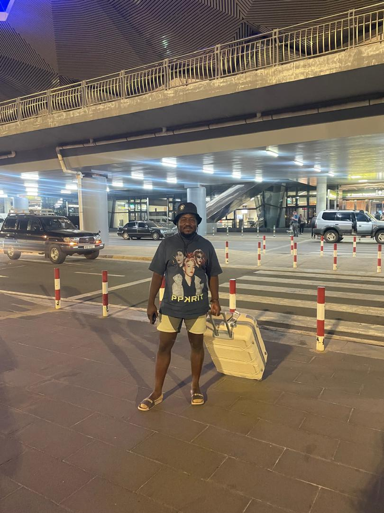

# David Silwamba's Birthday Invitation

A birthday invitation website for David Silwamba — 4th October 2026, Zambezi Way, Kitwe.

---

## Files

```
index.html   — main page
style.css    — all styles
script.js    — countdown, nav scroll, RSVP logic
photos/      — put David's photos in here (optional)
```

---

## Adding Photos

1. Create a `photos/` folder in the project root
2. Drop your images in (e.g. `david1.jpg`, `david2.jpg`, `david3.jpg`)
3. In `index.html`, find the `<!-- Photos added via JS -->` comment inside `#photoGrid`
4. Replace the placeholder block with:

```html
<div class="photo-frame">
  
</div>
<div class="photo-frame">
  
</div>
<div class="photo-frame">
  
</div>
```

---

## Setting up RSVP with Formspree (free)

Formspree collects each RSVP and emails it to you — no backend needed.

1. Go to [formspree.io](https://formspree.io) and create a free account
2. Click **New Form**, give it a name (e.g. "David Birthday RSVP"), set the notification email to yours
3. Formspree gives you an endpoint like `https://formspree.io/f/xpwzknrb` — copy the ID at the end (`xpwzknrb`)
4. Open `script.js` and replace `YOUR_FORMSPREE_ID` with that ID:
   ```js
   const FORMSPREE_ENDPOINT = 'https://formspree.io/f/xpwzknrb';
   ```
5. Each RSVP submission will arrive in your email inbox with the guest's name, phone, attending status, and number of guests.

---

## Deploy to GitHub + Vercel (same as your portfolio)

### Step 1 — Push to GitHub

```bash
git init
git add .
git commit -m "David's birthday invitation"
git branch -M main
git remote add origin https://github.com/YOUR_USERNAME/david-birthday.git
git push -u origin main
```

### Step 2 — Deploy on Vercel

1. Go to [vercel.com](https://vercel.com) and sign in
2. Click **Add New → Project**
3. Import your `david-birthday` GitHub repo
4. Leave all settings as default (it's plain HTML — no framework needed)
5. Click **Deploy**

Vercel gives you a URL like `david-birthday.vercel.app` in about 30 seconds.

### Step 3 — Custom domain (optional)

In your Vercel project → **Settings → Domains** → add your custom domain.

---

## Customising

| What to change | Where |
|---|---|
| Name, date, time, venue | `index.html` — hero and details sections |
| Host message | `index.html` — `#message` section |
| Colours | `style.css` — `:root` CSS variables at the top |
| Countdown target date | `script.js` — line with `new Date('2026-10-04T15:00:00+02:00')` |
| Photos | `index.html` — `#photoGrid` section |

---

Made with love by Suwi ♥
